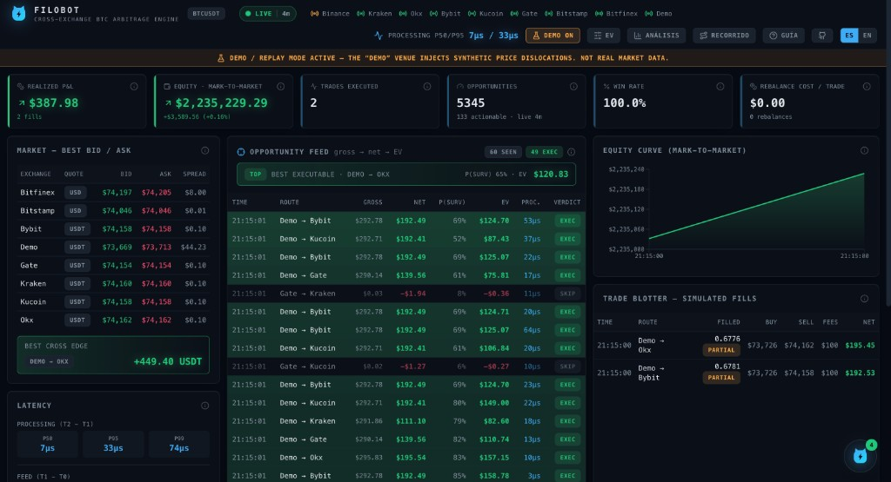
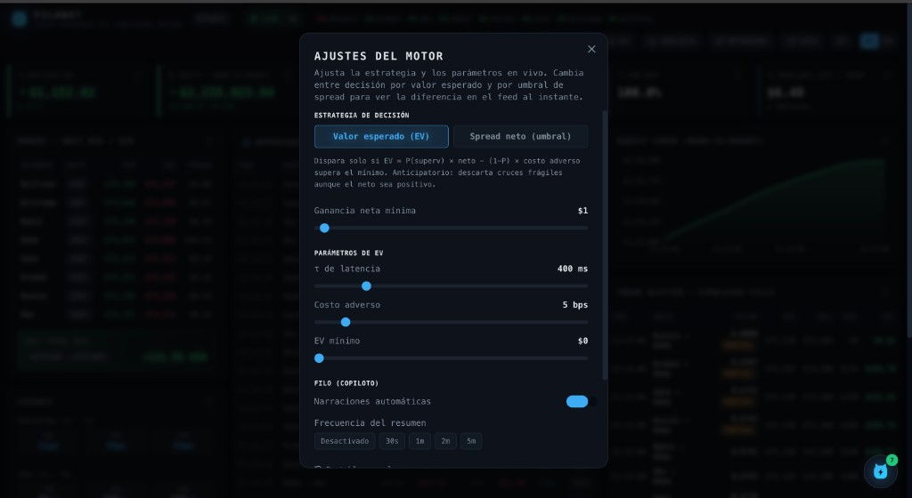
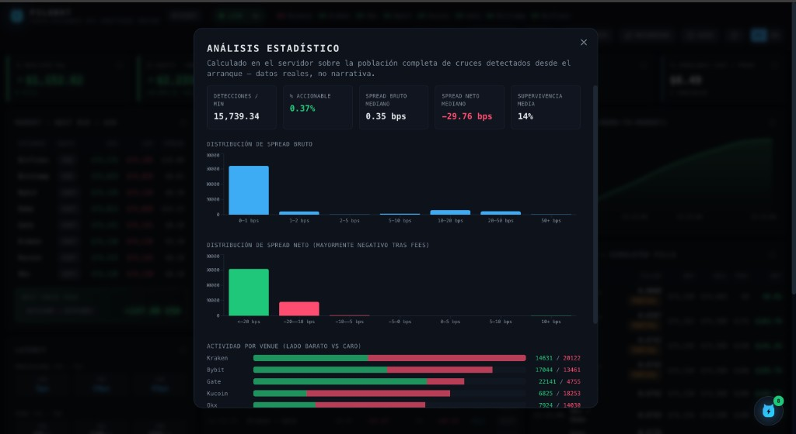
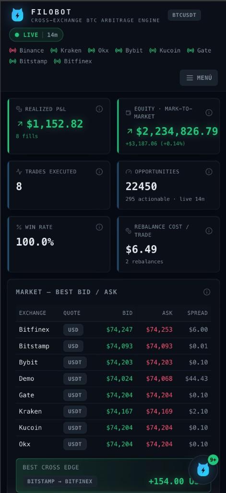
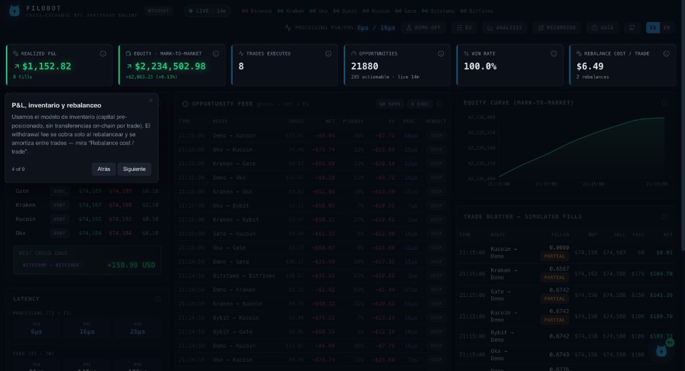
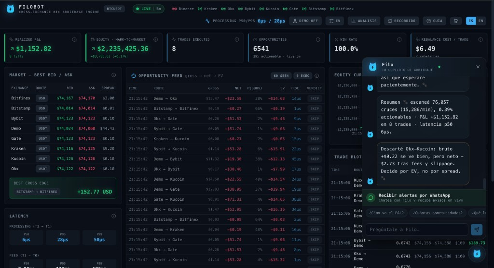
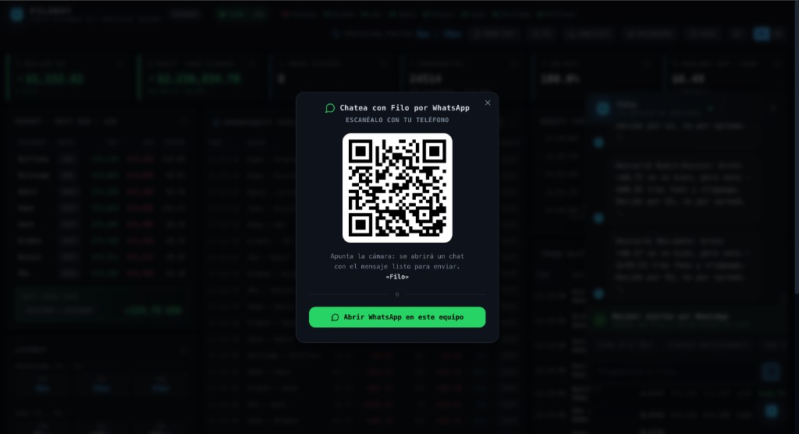
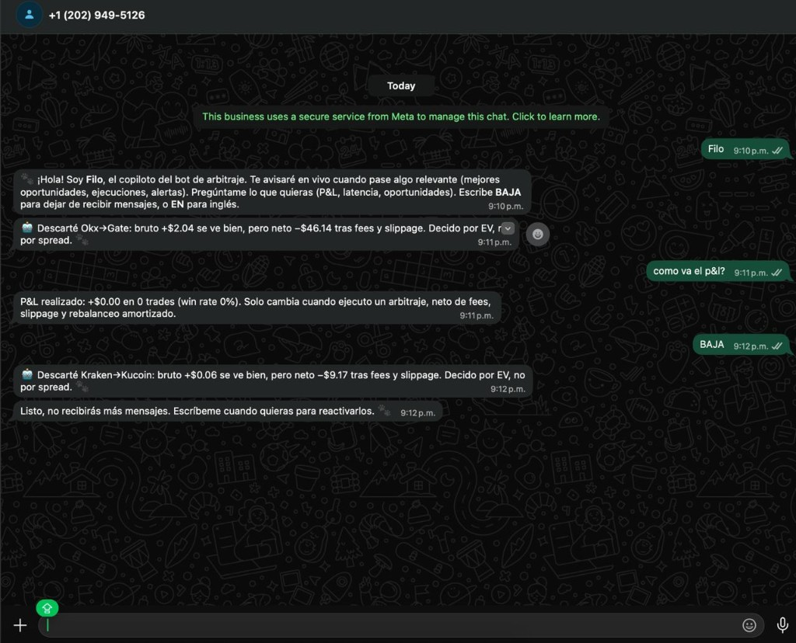

# Filobot — Terminal de Arbitraje BTC

**Filobot** hace detección de **arbitraje de Bitcoin entre exchanges** en tiempo real y **ejecución simulada**, construido para el reto de arbitraje de BTC. El sistema transmite order books en vivo de múltiples exchanges vía WebSocket, detecta divergencias de precio en el instante en que ocurren, calcula la rentabilidad **neta de comisiones y slippage por profundidad**, aplica controles de riesgo y simula la ejecución con llenados parciales y seguimiento de balances por wallet — todo visualizado en una terminal de trading en vivo.

> El código y los comentarios están en inglés (estándar de ingeniería); la documentación está en español por tratarse de una competencia en México. Ver [`docs/ARCHITECTURE.md`](docs/ARCHITECTURE.md) para el detalle técnico, [`docs/judging_criteria.md`](docs/judging_criteria.md) para el mapeo criterio-por-criterio + FAQ, y [`docs/FASE_FINAL.md`](docs/FASE_FINAL.md) para las **novedades de la fase final**.

## Vistazo

La **portada** funciona como *gate* de carga real: espera a que el stream de Socket.IO esté en vivo antes de dar entrada a la terminal.


**Terminal en vivo** — books por exchange, feed de oportunidades (bruto → neto → **EV** con veredicto `EXEC`/`SKIP`), curva de equity, blotter de fills simulados y panel de latencia p50/p95/p99. La píldora **LIVE** muestra el *uptime* real desde el arranque, y el gran contador de oportunidades *analizadas* vs. *accionables* cuenta la historia honesta.



<table>
<tr>
<td width="50%" valign="top">
<b>Ajustes del motor</b> — conmuta <i>en vivo</i> entre decisión por <b>EV</b> y por <b>umbral de spread</b>, y afina τ de latencia, costo adverso, EV mínimo y la cadencia de Filo. Los cambios viajan por Socket.IO y se reflejan al instante en el feed.
<br/><br/>

</td>
<td width="50%" valign="top">
<b>Análisis estadístico</b> — calculado en el servidor sobre <i>toda</i> la población de cruces detectados desde el arranque (datos reales, no narrativa): distribución de spread bruto vs. neto y actividad barato/caro por venue.
<br/><br/>

</td>
</tr>
<tr>
<td width="50%" valign="top">
<b>Diseño responsive</b> — en móvil la cabecera colapsa a un menú, las tarjetas se apilan y los paneles se adaptan, manteniendo legibles books, P&L y latencia. Pensado para que los jueces lo abran desde el teléfono.
<br/><br/>

</td>
<td width="50%" valign="top">
<b>Recorrido guiado</b> — un tour interactivo (driver.js) ilumina cada panel y explica la tesis paso a paso (modelo de inventario, EV, latencia…), para que se entienda sin contexto previo.
<br/><br/>

</td>
</tr>
</table>

**Filo, en dos transportes** 🐾 — el mismo cerebro (matcher determinista + capa opcional con Claude, siempre *grounded*) narra y responde tanto en el dashboard como en WhatsApp:

<table>
<tr>
<td width="40%" valign="top">
<b>Copiloto en el dashboard</b> — narra ejecuciones y <i>por qué descartó</i> cruces frágiles (bruto positivo, neto negativo) y responde con los números reales del motor.
<br/><br/>

</td>
<td width="30%" valign="top">
<b>Opt-in por QR</b> — en escritorio, un código QR abre WhatsApp en el teléfono con el mensaje de consentimiento ya listo.
<br/><br/>

</td>
<td width="30%" valign="top">
<b>Filo por WhatsApp</b> 📱 — avisos en vivo y preguntas libres vía Kapso dentro de la ventana de 24 h. <code>BAJA</code>/<code>STOP</code> cancela.
<br/><br/>

</td>
</tr>
</table>

## Por qué este diseño

- **Dirigido por eventos, no por polling.** El motor reevalúa en cada *tick* del order book y solo reverifica los pares de venues afectados por esa actualización — O(N) por actualización, no O(N²).
- **La ganancia neta se calcula recorriendo el book.** Una operación que se ve bien en el *top-of-book* a menudo se vuelve negativa dos niveles más abajo. Nunca asumimos que el mejor precio llena todo el tamaño.
- **Modelo de inventario, no transferencias por operación.** Las mesas de arbitraje reales pre-posicionan capital en ambos venues — la liquidación on-chain de BTC (~10–60 min) mataría toda oportunidad. Los balances se desvían con el tiempo (un venue acumula BTC, el otro USD), y mostramos esa desviación en lugar de esconderla tras transferencias instantáneas ficticias.
- **Costo de retiro amortizado, no por operación.** El *withdrawal fee* es un costo de **rebalanceo**: solo se cobra cuando el inventario cruza la banda de una política **(s,S)** y obliga a una transferencia on-chain. Lo amortizamos entre las operaciones y lo mostramos como "costo de rebalanceo / operación" — restarlo en cada trade descartaría oportunidades reales. Ver el panel de inventario más abajo.
- **Decisión por valor esperado (EV), no por umbral.** No disparamos cuando "spread > X": estimamos la **probabilidad de que el cruce sobreviva** nuestra ventana de latencia (heurística transparente sobre decaimiento por latencia, magnitud del *edge* e *imbalance* del book) y ejecutamos solo si `EV = P(supervivencia) × neto − (1−P) × costo_adverso > 0`. El dashboard muestra P(supervivencia) y EV en vivo, y el modo de decisión (EV vs. umbral de spread) es **conmutable en vivo** desde el panel de Ajustes — ver abajo.
- **Priorización por valor esperado.** En cada tick se ejecutan las oportunidades accionables de mayor a menor EV (no "la primera que aparece"), asignando el capital a la mejor primero; el dashboard resalta la "mejor ejecutable ahora".
- **Compuerta de riesgo antes de ejecutar.** Guarda de feed obsoleto, guarda de spread inverosímil (*glitch* de datos) y umbral mínimo de ganancia neta median entre "detectado" y "ejecutado".
- **Dos patas, y siempre volver a plano.** Cada ejecución son dos órdenes con su propio estado (`filled`/`partial`/`rejected`); si una falla queda un residual direccional que el motor deshace (re-hedge o unwind, el más barato) para no quedar con exposición abierta. Se puede *disparar* el fallo desde el inyector de escenarios — ver abajo.

## Arquitectura

```
Feeds WS (Binance · Kraken · OKX · Bybit · KuCoin · Gate.io · Bitstamp · Bitfinex)
        │  TopOfBook normalizado (escalera bids/asks + quote + timestamps)
        ▼
  OrderBookStore (en memoria, por exchange)
        ▼
  ArbitrageEngine  ── en cada tick ──▶  net-profit (depth walk) ──▶ RiskManager
        │                                                             │
        ├──▶ ExecutionSimulator (llenados parciales, balances)  ◀─────┘
        ├──▶ Portfolio (P&L, curva de equity)
        └──▶ LatencyTracker (procesamiento p50/p95/p99, antigüedad de feeds)
        │  Socket.IO
        ▼
  Dashboard web (Vite + React + shadcn/ui): books en vivo, feed de
  oportunidades (bruto vs neto), blotter de operaciones, curva de equity,
  panel de latencia y arbitraje triangular.
```

### Estructura del monorepo

```
btc_arbitrage_cchallenge/
├── packages/shared/   # Tipos de punta a punta = el contrato de datos de
│                      # Socket.IO, importado por AMBAS apps para no desincronizar.
├── apps/server/       # El bot: connectors, motor, simulador, Socket.IO.
└── apps/web/          # El dashboard: Vite + React + Tailwind + shadcn/ui.
```

## Stack tecnológico

- **Servidor:** Node + TypeScript, `ws` (feeds de exchange), `socket.io` (push al UI), Express (health). Corre con `tsx` en desarrollo y Node puro en producción. (Intencionalmente **no** corremos el servidor en Bun: los broadcasts de `socket.io` son poco confiables bajo el runtime actual de Bun — ver abajo.)
- **Web:** Vite 6, React 18, TypeScript, TailwindCSS, **shadcn/ui** (Radix), Recharts.
- **Tooling:** Bun workspaces (instalación + ejecución de tareas); el proceso del servidor se ejecuta en Node.

### Connectors

| Exchange | Canal | Quote | Notas |
|----------|-------|-------|-------|
| Binance | `@depth20@100ms` | USDT | snapshot parcial del book |
| Kraken | `book` v2 | USDT | snapshot + deltas, book local mantenido |
| OKX | `books5` | USDT | snapshot del top-5 por cambio |
| Bybit | `orderbook.50` | USDT | snapshot + deltas, *ping* JSON de keepalive |
| KuCoin | `level2Depth50` | USDT | bootstrap de token vía REST + *ping* JSON |
| Gate.io | `spot.order_book` | USDT | snapshot limitado cada 100ms |
| Bitstamp | `order_book_{pair}` | USD | snapshot top-100 por cambio |
| Bitfinex | `book` v2 | USD | snapshot + deltas, book local mantenido |

Todos los feeds son **públicos y sin API keys** (clean-room: el repo corre tal cual, sin credenciales). Agregar un venue es un solo archivo nuevo que implementa `BaseConnector` más una entrada en el registro.

**Agrupación por moneda de cotización.** Cada book lleva su `quote` (USDT/USD) y el motor **solo compara venues que cotizan el mismo activo**: cruzar un book BTC/USD con uno BTC/USDT surgiría un "arbitraje" fantasma que en realidad es el riesgo del peg de USDT, no un spread libre. Así, los venues USDT y USD forman dos *pools* independientes.

## Latencia: cómo se mide

Cada detección marca tres instantes:

| Símbolo | Significado |
|---------|-------------|
| `t0` | tiempo del evento del exchange (cuando está disponible) |
| `t1` | tiempo de recepción local del WebSocket |
| `t2` | tiempo de detección de la oportunidad |

- **Latencia de procesamiento** = `t2 − t1` — puramente nuestro código, independiente del desfase de relojes. Es el número que controlamos y optimizamos; se muestra en vivo como p50 / p95 / p99.
- **Latencia de feed** = `t1 − t0` — red + exchange, indicativa.

Optimizaciones en la ruta caliente: estado plano en memoria, nada bloqueante en el handler de mensajes, estadísticas agregadas empujadas en cadencia fija (fuera de la ruta caliente), y el navegador almacena en buffer los books de alta frecuencia y los vuelca en `requestAnimationFrame`.

## Arbitraje triangular

Además del arbitraje cross-exchange, el sistema monitorea **arbitraje triangular** de forma independiente en **cada venue configurado** (por defecto Binance, OKX, Bybit, KuCoin y Gate.io) sobre `BTC/USDT · ETH/BTC · ETH/USDT`, evaluando ambas direcciones del ciclo (`USDT → BTC → ETH → USDT` y su inverso) netas de tres *taker fees*. Cada venue obtiene sus propios tres connectors; el arbitraje triangular es intrínsecamente de **un solo exchange** (los tres pares deben ejecutarse en el mismo libro), por eso se corre por venue en vez de mezclar precios entre exchanges.

## Modo demo / replay

Los arbitrajes netos positivos reales entre venues importantes son prácticamente inexistentes, así que un demo puramente en vivo muestra un blotter (honestamente) vacío. Para demostrar la ruta de ejecución completa — llenados parciales, desviación de balances, P&L realizado, curva de equity — existe un **modo demo claramente etiquetado**:

- Un venue sintético `demo` cotiza alrededor del precio de referencia en vivo e inyecta dislocaciones breves y realistas, suficientes para superar las comisiones de ida y vuelta.
- Todo lo demás es el motor real: detección, net-profit por profundidad, riesgo, simulador, portafolio.
- Es **imposible confundirlo con datos reales** — se muestra un banner permanente y el venue se llama `demo`.
- **Seguro para dejarlo corriendo.** La memoria del proceso está **acotada por diseño** (curva de equity, ventanas de percentiles, timeline de rebalanceo e historial de chat tienen tope; el cliente recorta feeds a 60), así que ni el modo en vivo ni el demo acumulan memoria por horas. Y cuando se desconecta el **último cliente**, el inyector de demo se **auto-apaga** para no fabricar trades sintéticos sin público en el deploy compartido — los feeds reales siguen; al volver, se re-activa con un clic (o la tecla `D`).

Actívalo en vivo desde el dashboard (botón **Demo**), o arranca con él encendido:

```bash
DEMO_MODE=true bun run dev:server
```

## Centro de parametrización en vivo

> **Novedad de la fase final.** Todo el comportamiento del bot es **ajustable en vivo** desde el control **Parámetros** de la barra de estado (con chip de modo EV/Spread y badge del contador). Se abre como **drawer lateral persistente** —no un modal que tapa el dashboard— así puedes **ajustar un parámetro y ver reaccionar el feed y el P&L al instante, sin cerrar nada** (en móvil cae a bottom-sheet). Nada requiere reinicio: cada cambio viaja por Socket.IO, se **valida y acota** en el servidor, y se refleja al instante en el feed, el P&L y en **todos los clientes conectados**. Para power-users hay **atajos de teclado** (`D` demo · `P` parámetros · `S` análisis · `?` guía · `Esc` cerrar; se desactivan mientras escribes). El detalle de esta fase está en [`docs/FASE_FINAL.md`](docs/FASE_FINAL.md).

El panel está **agrupado por sección** y encabezado por un contador de **cuántos controles están vivos** (`N controles en vivo`), que crece con el número de venues:

- **Presets de estrategia** — un clic aplica un *bundle* completo y cambia la postura de riesgo al instante: **Conservador** (EV alto, size chico, guards estrictos), **Balanceado** (defaults), **Agresivo** (size grande, guards laxos) y **Mesa / MM** (modo spread, inventario ajustado). Ideal para que un juez "juegue" y vea el sistema reaccionar.
- **Estrategia** — modo de decisión **EV ↔ spread** (ver abajo) y `ganancia neta mínima`.
- **Valor esperado (EV)** — `τ` de latencia, costo de selección adversa y EV mínimo.
- **Tamaño y capital** — `nominal máximo por pata` (tamaño de orden).
- **Riesgo y guardas** — `spread máximo` (guarda anti-glitch de datos), `antigüedad máxima de quote` (guarda de feed obsoleto) y `desviación máxima vs consenso` (guarda de **feed dislocado**: descarta un venue que se aleja de la mediana multi-venue — ver [Robustez](#robustez-máquina-de-estados--inyector-de-escenarios)).
- **Rebalanceo de inventario** — `umbral de drift` (BTC) que dispara una transferencia on-chain y cobra el withdrawal fee amortizado.
- **Fees por exchange** — editor del **taker fee de cada venue**. Súbelo y verás cómo mueren cruces que antes eran rentables; bájalo a 0 y verás cuántos aparecen. El fee es la variable que decide qué es arbitraje y qué no.
- **Exchanges activos** — *toggle* por venue para **incluirlo o excluirlo del arbitraje** en vivo. Su feed **sigue transmitiéndose** en el panel de mercado; simplemente deja de participar en la comparación y la ejecución.
- **Filo** — cadencia del resumen y silenciar/activar narraciones.
- **Exportar reporte de sesión** — descarga toda la sesión como evidencia en **JSON** (config exacta en uso + P&L/inventario + análisis de spreads + blotter con estados por pata) o **CSV** (trades aplanados, listos para Excel/Sheets). Se arma **en el navegador** desde el mismo estado que pinta el dashboard — sin round-trip al servidor ni secrets (clean-room).

### La tesis, en vivo: EV vs spread

El corazón del panel — **decidir por valor esperado, no por umbral de spread** — no se queda en el papel:

- **Valor esperado (EV):** ejecuta solo si `EV = P(supervivencia) × neto − (1−P) × costo_adverso` supera el mínimo. Anticipatorio: descarta cruces frágiles aunque su neto sea positivo.
- **Spread neto (umbral):** modo ingenuo — ejecuta con cualquier spread neto positivo que pase la compuerta de riesgo.

EV y P(supervivencia) se calculan y muestran **en ambos modos**, así que el efecto del cambio es inmediato y visible en el feed: al pasar a `spread` empiezan a dispararse cruces que EV rechazaba por frágiles. Es la diferencia "bot promedio vs. mesa real" hecha demostración en vivo, no solo descrita.

> **Por qué importa (criterio #1 del jurado).** El comité subrayó que *"el grado de profundidad con el que parametricen las distintas opciones"* sería uno de los factores que más diferencian a los proyectos, y preguntó explícitamente por **fees, tamaños de orden y exchanges activos**. Los tres — más los guards, el rebalanceo y la estrategia — se ajustan aquí, en vivo, desde la UI.

## Robustez: máquina de estados + inyector de escenarios

> **Novedad de la fase final.** No te contamos cómo manejamos un fallo: **lo disparas tú y lo miras**. Detalle en [`docs/FASE_FINAL.md`](docs/FASE_FINAL.md).

Cada ejecución se modela como **dos patas independientes** (compra y venta), cada una con su propio estado — `filled` · `partial` · `rejected`. Cuando las patas no coinciden (una se rechaza, o la liquidez/gap solo llena un lado) queda un **residual direccional** (Δ en BTC), y el motor **vuelve a plano** eligiendo la opción más barata por precio:

- **Re-hedge (completar):** ejecuta la pata faltante en el venue contraparte — captura la intención del arb a un precio peor.
- **Unwind (deshacer):** revierte la pata que sí llenó — renuncia al arb con tal de quedar plano.

La prioridad siempre es **no quedarse con exposición direccional abierta**. La contabilidad es exacta: el simulador calcula los deltas por wallet de ambas patas más la resolución, el BTC se conserva a plano, y el P&L realizado es la suma de los deltas en USD.

El **inyector de escenarios adversos** (claramente etiquetado, banner rojo + sección en Ajustes) deja que el juez fuerce esos fallos en vivo:

- **Rechazo de pata** — cada pata puede rechazarse (fill 0).
- **Recorte de liquidez** — encoge la profundidad del book (crunch).
- **Gap de precio en ejecución** — el mercado se mueve en contra a mitad de la operación.

En el **blotter** cada fila muestra el estado de cada pata (B✓ / S✕ / ◑) y un badge `RE-HEDGED` / `UNWOUND` / `PARTIAL` con el residual y el costo de aplanar; **Filo narra** cada vuelta a plano. Un filtro **Residual · partial** aísla justo los fills que la máquina de estados tuvo que resolver, y cada fill nuevo hace un breve *flash* (verde/rojo) para leer la actividad de un vistazo. Bajo un gap fuerte los netos salen en rojo — y así debe ser: el mercado se movió en contra y el sistema lo refleja con honestidad. Como todo lo sintético (igual que el modo demo), es **imposible confundirlo con datos reales**, arranca inactivo y no requiere credenciales.

Implementación: `apps/server/src/engine/executionSimulator.ts` (patas, rejects, haircut, gap, resolución) y `engine/portfolio.ts` (aplica los deltas). El estado del escenario es parte de `EngineConfig.scenario` y viaja por el mismo `updateConfig` validado en el servidor.

### Guarda de feed dislocado (consenso multi-venue)

Un feed que se atrasa o entra en reconexión (típico en un host con throttling: el event loop se congela y luego procesa un backlog de mensajes que **parecen frescos** por su hora de recepción, pero cuyo precio es viejo) queda **dislocado** del resto del mercado y fabricaría "arbitrajes" fantasma. Además del guard de antigüedad y del de spread inverosímil, el motor calcula en cada tick la **mediana de los mids** de los venues frescos (quórum ≥3) y **descarta cualquier ruta cuyo venue se desvíe más de un umbral** (`maxVenueDeviationPct`, 1% por defecto, ajustable en vivo) de ese consenso. Es **independiente del reloj**, así que sobrevive a los stalls del event loop donde una cotización vieja luce fresca. El venue `demo` (dislocado a propósito) está exento. Implementación: `arbitrageEngine.computeConsensusMid` + `engine/riskManager.ts`.

### Resiliencia de UI (sin pantallas en negro)

El frontend está envuelto en un **error boundary** (`apps/web/src/components/ErrorBoundary.tsx`): si un payload llega con una forma inesperada (p. ej. un desfase de versión servidor/cliente durante un redeploy parcial), se muestra un mensaje recuperable con botón de recarga en vez de dejar la pantalla en negro. El blotter además degrada con gracia trades sin estado por pata (builds antiguos), sin tumbar el dashboard.

## Inventario y rebalanceo (s,S)

> **Novedad de la fase final.** El rebalanceo dejó de ser un umbral escondido y pasó a ser una **política de inventario visible y configurable**.

Cada venue tiene un **objetivo** de BTC (nivel *order-up-to*, su baseline inicial) y una **banda muerta** `[objetivo − banda, objetivo + banda]`, con `banda = rebalanceThresholdBtc` (ajustable en vivo). Mientras el BTC se mantenga dentro de la banda no se hace nada; al cruzar el **techo**, el venue envía el excedente de vuelta al **objetivo** (no al límite). Esa distancia entre el disparador (s) y el nivel de retorno (S) es lo que **evita el thrashing**. El excedente va al venue más agotado, se liquida la pata USD internamente y solo se cobra el **withdrawal fee** on-chain — amortizado entre trades, no por operación.

El **panel de inventario** ("Inventory & rebalancing — (s,S)") lo hace tangible:

- **Barra objetivo vs. actual por venue** — BTC actual (verde dentro de banda, rojo fuera) contra el objetivo y la banda muerta pintada.
- **Capacidad restante** — cuántos trades más aguanta cada venue antes de quedarse sin el balance que lo limita.
- **Pronóstico de deriva** — una EWMA de la deriva de inventario por venue (BTC/trade) proyecta *"≈ N trades hasta el techo/piso"*, para anticipar el próximo rebalanceo antes de que ocurra. Es una extrapolación transparente (heurística, no promesa): si la deriva es despreciable, dice *estable*.
- **Timeline de rebalanceos** — transferencias recientes (hora, ruta, monto ₿, costo) + KPIs de costo amortizado por trade y banda activa.

Implementación: `engine/portfolio.ts` (`rebalanceIfNeeded` como (s,S) + `inventory()`); los datos viajan en `PortfolioStats.inventory` y `PortfolioStats.rebalancing`.

## Operación en vivo: portada, uptime y reinicio de sesión

- **Portada de entrada.** El sistema abre con una **portada a pantalla completa** (logo, autoría y enlaces a repo/LinkedIn) que además funciona como **gate de carga real**: el botón "Continuar" permanece en estado *conectando…* hasta que el stream de Socket.IO está activo, y al entrar reproduce una transición de fundido/desenfoque hacia el dashboard.
- **Indicador "en vivo" + uptime.** La barra de estado muestra una píldora **LIVE** con el **tiempo en línea desde el arranque** del servidor (`startedAt` viaja en el `config`). Como el motor procesa en continuo desde el despliegue, el gran contador de oportunidades *analizadas* es evidencia de **rendimiento y uptime reales**; la historia honesta está en la **proporción** analizadas vs. accionables.
- **Reinicio de sesión.** Desde **Ajustes** se pueden **poner a cero las métricas** (P&L, trades, oportunidades, curva de equity) — con confirmación — para observar desde cero (ideal junto al modo demo). El motor reconstruye el portafolio y re-fija la línea base de equity al *mark* actual; **no toca los feeds en vivo**. El servidor reemite snapshots y avisa a los clientes (`reset`) para limpiar sus buffers locales.

## Filo: copiloto conversacional 🐾

El dashboard incluye a **Filo**, un asistente de chat con la personalidad de la mascota del proyecto (una gata real — ver [`whyfilo.md`](whyfilo.md)). Filo cumple la idea de "IA **fuera** del hot path": **narra e interpreta**, nunca decide los trades.

- **Narración en vivo.** Filo avisa cuando algo relevante ocurre — la mejor oportunidad accionable, ejecuciones, *por qué descartó* un cruce (bruto positivo pero neto negativo), cambio de modo demo o caída de un feed — más un **resumen periódico** de la sesión. Todo *throttled* por categoría para no saturar.
- **Preguntas a demanda.** Pregúntale por P&L, equity, oportunidades, latencia, mejor trade, rebalanceo, supervivencia o venues. Las respuestas se construyen con los **números reales del motor**.
- **Dos capas, con degradación elegante.** Primero un **matcher determinista** (instantáneo, sin costo, siempre disponible y *grounded*); para preguntas libres, una **capa opcional con Claude** estrictamente *grounded* (solo ve el estado en JSON, con instrucción de **nunca inventar cifras**). Si no hay API key, hay timeout o falla la llamada, Filo cae de vuelta a la respuesta determinista — la demo nunca depende de una llamada remota.
- **Una sola mente, dos transportes.** El "cerebro" de Filo es agnóstico al transporte: habla por Socket.IO con el dashboard **y por WhatsApp** (ver abajo) reutilizando exactamente la misma capa determinista + LLM.

Es **opcional**: sin `ANTHROPIC_API_KEY`, Filo funciona igual con sus respuestas deterministas. Con la key, además maneja preguntas libres vía Claude.

### Filo por WhatsApp 📱

Filo también vive en WhatsApp (vía [Kapso](https://kapso.ai)). El visitante toca un enlace **click-to-chat** y envía una palabra clave: eso (1) da su **consentimiento**, (2) abre la **ventana de 24 h** de WhatsApp para mensajes libres y (3) lo registra como suscriptor. A partir de ahí Filo **empuja avisos en vivo** (mejores oportunidades, ejecuciones, alertas — *throttled* por persona) y **responde preguntas** con el mismo cerebro del dashboard. Escribir `BAJA`/`STOP` cancela.

- Las suscripciones se guardan en **MongoDB** si hay `MONGODB_URI`; si no, en memoria (clean-room).
- Todo es **opcional**: sin credenciales de Kapso, el botón se oculta y el bridge no hace nada.
- Igual que el LLM, el transporte y la persistencia viven **fuera del hot path**: ningún envío de WhatsApp ni escritura a Mongo puede bloquear la detección/ejecución.

## Ejecución local

Requiere [Bun](https://bun.sh) (o Node ≥ 20).

```bash
bun install
cp .env.example .env   # opcional; trae valores por defecto razonables
bun run dev            # levanta servidor (:4000) y web (:5173) juntos
```

Luego abre http://localhost:5173.

Por separado:

```bash
bun run dev:server
bun run dev:web
```

### Calidad: typecheck + tests + CI

```bash
bun run typecheck   # tsc en shared + server + web
bun run test        # suite de tests del motor (apps/server/tests)
```

La lógica pura del motor está cubierta por tests unitarios (sin red): el
*depth-walk* neto-de-todo (`profit`), la máquina de ejecución en dos patas con
vuelta a plano (`executionSimulator`) y el rebalanceo (s,S) del `portfolio`. Ambos
comandos corren en **CI** (`.github/workflows/ci.yml`) en cada push/PR. El
**porqué** de cada decisión de diseño está en [`docs/DECISIONS.md`](docs/DECISIONS.md).

## Configuración

Todo es opcional — ver `.env.example`. Lo más relevante:

| Variable | Default | Descripción |
|----------|---------|-------------|
| `EXCHANGES` | `binance,kraken,okx,bybit,kucoin,gate,bitstamp,bitfinex` | Connectors de exchange habilitados. Cada venue se puede excluir/incluir del arbitraje **en vivo** desde Ajustes (su feed sigue transmitiendo) |
| `TRIANGULAR_EXCHANGES` | `binance,okx,bybit,kucoin,gate` | Venues con arbitraje triangular |
| `SYMBOL` | `BTCUSDT` | Par a monitorear |
| `MAX_NOTIONAL_USD` | `50000` | Tope nominal por pata simulada. También ajustable en vivo |
| `MIN_NET_PROFIT_USD` | `1` | Ganancia neta mínima para ejecutar. También ajustable en vivo |
| `MAX_SANE_SPREAD_PCT` | `0.05` | Rechaza spreads más anchos como datos erróneos. También ajustable en vivo |
| `MAX_QUOTE_AGE_MS` | `2000` | Guarda de feed obsoleto. También ajustable en vivo |
| `MAX_VENUE_DEVIATION_PCT` | `0.01` | Guarda de **feed dislocado**: descarta un venue que se desvía más de esto de la mediana multi-venue (evita arbitrajes fantasma por feeds lentos/atascados). `0` la desactiva. También ajustable en vivo |
| `REBALANCE_THRESHOLD_BTC` | `0.5` | Desviación de inventario que dispara un rebalanceo (cobra withdrawal fee amortizado). También ajustable en vivo |
| `EV_TAU_MS` | `400` | Constante de decaimiento por latencia del modelo de supervivencia |
| `EV_ADVERSE_BPS` | `5` | Costo de selección adversa (bps) si el edge colapsa |
| `EV_MIN_USD` | `0` | Valor esperado mínimo para ejecutar |
| `DECISION_MODE` | `ev` | Regla de decisión: `ev` (valor esperado) o `spread` (umbral de spread neto). También conmutable en vivo desde el panel de Ajustes |
| `DEMO_MODE` | `false` | Arrancar con el inyector demo/replay encendido |
| `ANTHROPIC_API_KEY` | — | (Opcional) Habilita las respuestas libres de Filo vía Claude; sin ella, Filo usa solo sus respuestas deterministas |
| `FILO_MODEL` | `claude-3-5-haiku-latest` | Modelo de Claude para las respuestas libres de Filo |
| `FILO_DIGEST_MS` | `75000` | Periodo (ms) del resumen no solicitado de Filo; `0` lo desactiva. Ajustable en vivo |
| `FILO_NARRATE` | `true` | Si Filo emite narraciones no solicitadas (`false` las silencia; las respuestas a preguntas no se ven afectadas). Ajustable en vivo |
| `MONGODB_URI` | — | (Opcional) Persiste las suscripciones de WhatsApp; sin ella, almacenamiento en memoria (clean-room) |
| `KAPSO_API_KEY` | — | (Opcional) Habilita el transporte de WhatsApp (Filo por WhatsApp) vía Kapso |
| `KAPSO_PHONE_NUMBER_ID` | — | ID del número de WhatsApp Business para el envío |
| `KAPSO_WEBHOOK_SECRET` | — | Secreto para verificar la firma (HMAC-SHA256) de los webhooks entrantes |
| `WHATSAPP_NUMBER` | — | Número público (E.164, solo dígitos) para el enlace `wa.me` de click-to-chat |
| `WHATSAPP_KEYWORD` | `Filo` | Palabra clave de opt-in prellenada en el enlace |

## Despliegue

Guía paso a paso en **[`docs/DEPLOY.md`](docs/DEPLOY.md)**. Resumen:

- **Servidor** (`apps/server`) → Railway / Render / Fly. Proceso de larga vida (Express + Socket.IO + 8 feeds WebSocket en vivo). **Corre en Node, no en Bun** — los broadcasts de Socket.IO son poco fiables bajo Bun — y se ejecuta directo desde TypeScript con `tsx` (sin paso de compilación, porque `@arb/shared` se consume como código fuente TS). Arranque: `npm start`.
- **Web** (`apps/web`) → Vercel / Netlify / Cloudflare Pages. Bundle estático de Vite; se construye con `VITE_SERVER_URL` apuntando al servidor.
- **Directorio raíz = raíz del repo** en ambos: es un monorepo y la instalación debe correr desde la raíz para que el workspace `@arb/shared` se resuelva.
- **Infra versionada**: [`railway.json`](railway.json) + [`nixpacks.toml`](nixpacks.toml), [`render.yaml`](render.yaml) (Blueprint: servidor + web) y [`vercel.json`](vercel.json) ya traen build/start/health-check configurados.

## Nota sobre el realismo

El arbitraje limpio de BTC/USDT entre venues importantes es **raro y de poca profundidad** — los mercados eficientes cierran estas brechas rápido. Un sistema que muestra *pocas pero genuinamente positivas* oportunidades (y rechaza las falsas) es más honesto que uno que aparenta "imprimir dinero", lo cual suele indicar un error de modelado.

## ¿Por qué "Filobot"?

Por **Filomena**, la gata del autor y mascota oficial del proyecto. Conoce a la jefa en [`whyfilo.md`](whyfilo.md). 🐾
