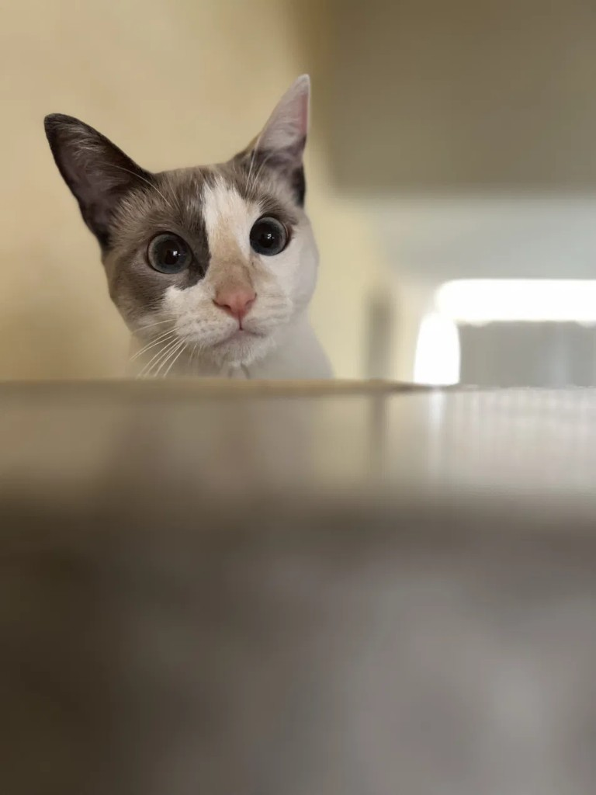

# 🐾 Saluden a Filomena, mi gato programador

  

> *"Saluden a Filomena, mi gato programador."*

Sí, **Filobot** se llama así por ella. Filomena (cariñosamente **Filo**) es la inspiración, la mascota y la jefa de producto no remunerada de este proyecto. Pasa los días vigilando que ningún spread se le escape… casi siempre desde el borde de la mesa, juzgando silenciosamente cada decisión de trading.

## Hoja de vida (CV felino)

| Campo | Detalle |
|-------|---------|
| **Nombre** | Filomena |
| **Alias** | Filo, jefa, *quality assurance* |
| **Puesto** | Co-fundadora y cara de la marca |
| **Especialidad** | Detección de oportunidades (de comida) en tiempo real |
| **Latencia de reacción** | sub-milisegundo cuando se abre una lata 🥫 |
| **Lenguajes** | maullido, ronroneo, y un poco de TypeScript por ósmosis |
| **Estrategia favorita** | arbitraje entre "el sofá" y "el teclado" |
| **Postura sobre IA** | la IA narra; **ella** decide (igual que en el hot path) |

## Por qué un gato en un bot de arbitraje

Porque los mejores traders comparten cualidades con los gatos: **paciencia** para esperar la oportunidad correcta, **reflejos** para actuar al instante, y la **disciplina** de ignorar el 99% de los cruces que no valen la pena. Filo encarna la tesis del proyecto: no se trata de moverse por mover, sino de **decidir por valor esperado** — y luego echarse una siesta.

El asistente conversacional del dashboard lleva su nombre: **Filo** te narra lo que pasa en el mercado y responde tus preguntas, siempre con datos reales del motor. Es lo más cerca que estará Filomena de tener un trabajo de verdad.

---

Ningún gato fue molestado durante el desarrollo de este proyecto. Filomena aprueba este mensaje. 🐾

